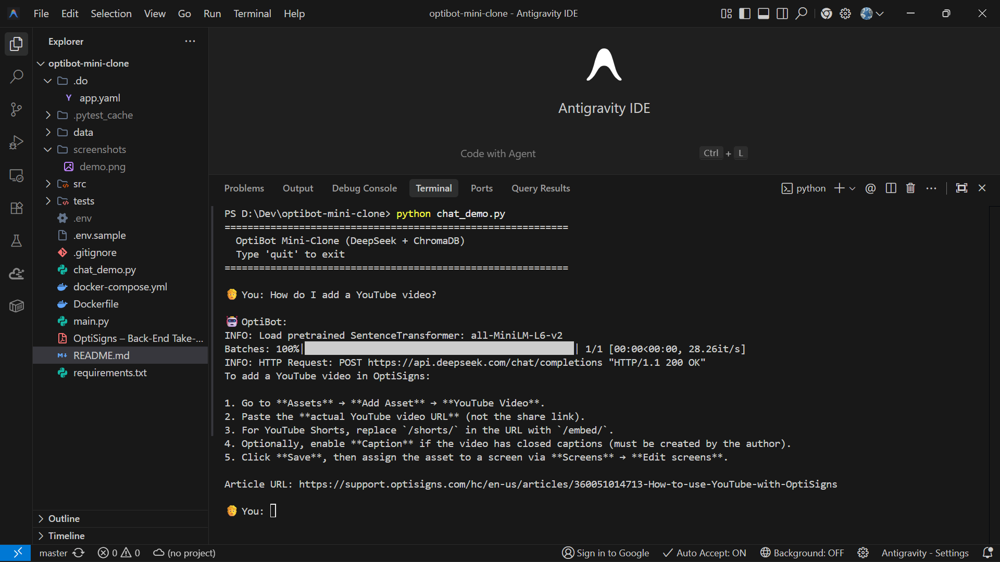

# OptiBot Mini-Clone

RAG-powered customer support bot that scrapes OptiSigns help center articles, indexes them in a vector database, and answers questions with cited article URLs.

**Stack:** Python 3.12 · DeepSeek (LLM) · ChromaDB (vector DB) · sentence-transformers (embeddings)

## Setup

```bash
python -m venv .venv
.venv\Scripts\activate       # Windows
# source .venv/bin/activate  # macOS/Linux
pip install -r requirements.txt
```

Copy `.env.sample` → `.env` and add your [DeepSeek API key](https://platform.deepseek.com/).

## Run Locally

```bash
# Scrape + embed (daily job)
python main.py

# Interactive chat
python chat_demo.py
```

Ask _"How do I add a YouTube video?"_ and get answers with cited article URLs.

## Docker

```bash
docker build -t optibot .
docker run --env-file .env -v ./data:/app/data optibot           # scraper job
docker run -it --env-file .env -v ./data:/app/data optibot python chat_demo.py
```

## Chunking Strategy

1. Split by `##` headings (section-level)
2. Sections >1000 chars → split by paragraphs with 100-char overlap
3. Chunks <20 chars discarded
4. Each chunk tagged with `article_id`, `url`, `title`

## Delta Detection

SHA-256 content hashes in `state.json`. Only new/changed articles re-embedded. Logs: `Added / Updated / Skipped / Removed`.

## Daily Job

Deployed on DigitalOcean App Platform via `cron: "0 3 * * *"`. See `.do/app.yaml`.
Logs: [DigitalOcean App → daily-scrape](https://cloud.digitalocean.com/apps/3579483a-f0b1-41e2-874c-1ce24348ee05/deployments/62a863ff-88dc-4f4d-8cd1-8b019a06b1af?i=fa5c46)

## Tests

```bash
pip install pytest
pytest tests/ -v
```

## Screenshot




# Build trigger comment


