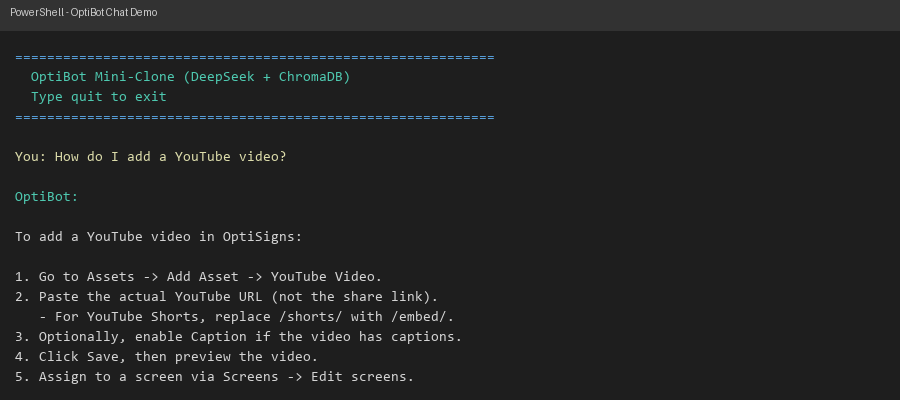

# 🤖 Support Bot RAG Engine

A customer-support chatbot that scrapes help center articles, indexes them in a local vector database, and answers questions with cited article URLs.

**Stack:** Python 3.12 · DeepSeek (LLM) · ChromaDB (vector DB) · sentence-transformers (embeddings)

## Quick Setup

```bash
# Clone and install
git clone https://github.com/your-user/your-repo-name.git
cd your-repo-name
python -m venv .venv
.venv\Scripts\activate       # Windows
# source .venv/bin/activate  # macOS/Linux
pip install -r requirements.txt
```

Copy `.env.sample` → `.env` and add your [DeepSeek API key](https://platform.deepseek.com/).

## How to Run Locally

### 1. Scrape & Index (first-time or daily refresh)

```bash
python main.py
```

This will:
- Fetch all articles from the help center (Zendesk API)
- Convert to Markdown and save to `data/articles/`
- Detect new/updated articles via SHA-256 hash comparison
- Embed and store chunks in ChromaDB (`data/chromadb/`)

### 2. Chat with the Bot

```bash
python chat_demo.py
```

Ask questions like *"How do I add a YouTube video?"* and get answers with cited article URLs.

## Docker

```bash
# Build
docker build -t optibot .

# Run scraper job
docker run --env-file .env -v ./data:/app/data optibot

# Run chat demo
docker run -it --env-file .env -v ./data:/app/data optibot python chat_demo.py
```

## Chunking Strategy

1. Articles split by `##` headings (section-level chunks)
2. Sections >1000 chars further split by paragraphs with 100-char overlap
3. Chunks <20 chars are discarded
4. Each chunk tagged with `article_id`, `url`, `title` for citation retrieval

## Delta Detection

- SHA-256 hash of each article's full Markdown content
- `state.json` persists hashes between runs
- Only new/changed articles are re-embedded → efficient daily updates
- Logs: `Added: N, Updated: N, Skipped: N, Removed: N`

## Daily Job

Deployed on DigitalOcean App Platform as a scheduled Docker job:
- Cron: `0 3 * * *` (daily at 3 AM UTC)
- Logs: [DigitalOcean App Platform → Jobs → daily-scrape](https://cloud.digitalocean.com/apps)

## Tests

```bash
pip install pytest
pytest tests/ -v
```

## Screenshot


